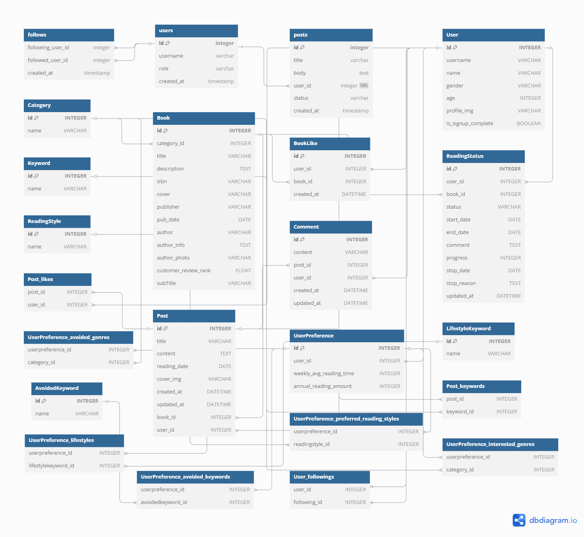
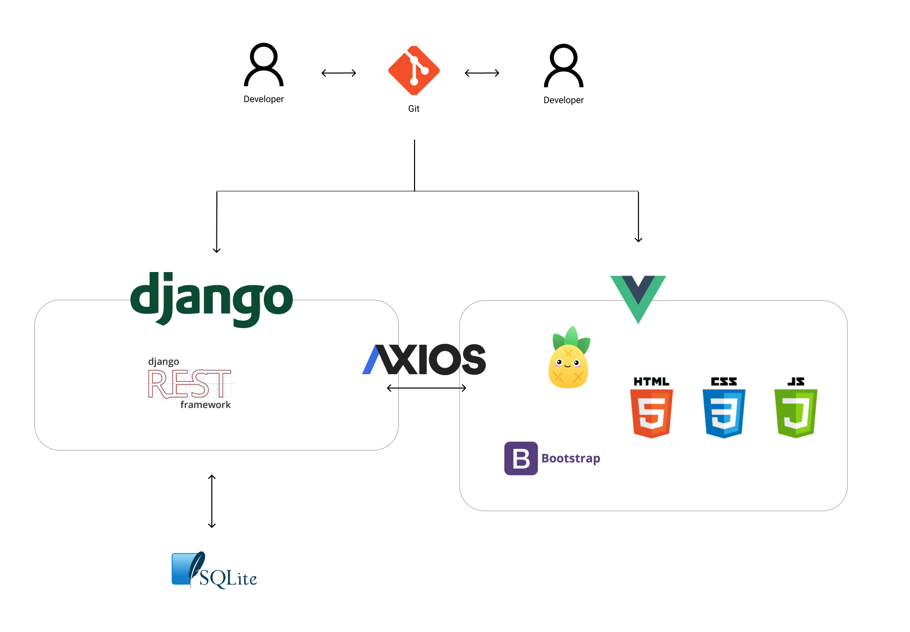

# 📚 Bookie – 당신만을 위한 도서 추천 플랫폼

## 1. 프로젝트 개요

- **프로젝트 기간** : 2025/05/22 ~ 2025/05/27 (약 6일)

- **프로젝트 배경**
  1. **도서 추천 서비스의 부재**  
     독서 의지는 있지만 어떤 책을 읽어야 할지 결정하기 어려워하는 사용자가 많습니다.
  2. **텍스트힙 문화 확산**  
     '서울 힙도서관', '야외 도서관' 등 감성 독서 장소의 확산으로 독서는 개성과 멋을 표현하는 하나의 활동으로 인식되고 있습니다.

- **서비스명**  
  
  
  Bookie는 **Book**과 **Bestie**의 합성어입니다.  
  가장 가까운 친구처럼, 당신에게 어울리는 책을 추천합니다.

- **프로젝트 소개**
  
  Bookie는 설문과 독서 이력을 바탕으로 인생 책을 찾아주는 **AI 도서 추천 플랫폼**입니다.  
  개인의 서재 관리와 감상글 공유를 통해 **독서의 깊이와 즐거움**을 함께 확장해보세요.

---

## 2. 서비스 구조

### 📌 ERD

### 🏗 아키텍처

---

## 🛠 기술 스택

### 🔸 Frontend  

### 🔹 Backend  

---

## 주요 기능

### 01. 설문 기반 추천 시스템
- 사용자가 작성한 설문을 기반으로 AI가 주요 키워드를 분석하여 맞춤형 도서 추천
- 회원은 추가적인 추천 방식이 작동, 개인의 회원 독서 취향 반영

### 02. 나만의 서재
- 읽고 싶은 책, 읽고 있는 책, 완독한 책 등 다양한 **독서 상태**로 도서 관리 가능
- 내가 남긴 독서 포스트 또한 한눈에 파악 가능

### 03. 포스트 커뮤니티
- 사용자는 책에 대한 감상이나 의견을 자유롭게 작성하고 공유 가능
- 다른 사용자의 포스트를 조회하고 소통함으로써 **독서 취향을 확장**할 수 있음

---

## 역할 분담

| 이름             | 담당 영역                                   | 주요 구현 기능                                                                                                                 |
| ---------------- | ------------------------------------------- | ------------------------------------------------------------------------------------------------------------------------------ |
| **곽서현 (팀장)** | `accounts (회원 / 인증)` `main (메인)`   | - 회원가입, 로그인, 마이페이지, 인증 관련 API 구현 - 사용자의 설문 정보 및 책장 구현 - 설문 조사 기반 추천 알고리즘 구현 |
| **김미진**       | `book (도서)` `post (포스트 / 커뮤니티)` | - 도서 모델 설계 및 CRUD 구현 - 사용자의 책 포스트 CRUD 구현 - 독서 상태 기반 추천 알고리즘 구현                         |
